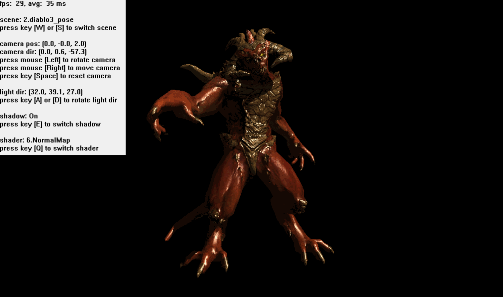

# miniSoftwareRenderer

用 C++ 从零实现的软件光栅化渲染器。不调用任何图形 API —— 每个三角形都由 CPU 逐像素计算，结果写入内存中的后台缓冲，再由 Win32 窗口实时呈现。

## 已实现

**渲染管线**

- OBJ 模型读取、TGA 贴图解码
- MVP 变换 → 透视除法 → 视口变换
- 7 平面齐次裁剪（`w > 0` 以及 ±x / ±y / ±z），裁剪结果重组为三角扇形
- 背面剔除、Z-Buffer 深度测试
- 1/w 透视矫正插值
- Shadow Map：光源 VP 矩阵 + 依据 n·l 的自适应 bias

**引擎结构**

- `IShader` 将顶点着色器与片元着色器分开，中间以 `a2v` / `v2f` 结构体传递数据，写法接近 Unity Shader
- 6 个可选 Shader：Ground、Toon、Texture、TextureWithLight、Blinn、NormalMap（阴影在 Blinn / NormalMap 中生效）
- `Transform` + `GameObject` + `Scene`：每个物体各自持有位置 / 旋转 / 缩放，由场景统一管理模型、灯光与摄像机
- Win32 实时窗口、环绕摄像机，以及屏幕 HUD（帧率、相机与灯光状态、操作提示）



## 控制

| 按键 / 鼠标 | 作用 |
| --- | --- |
| `W` / `S` | 切换场景（模型） |
| `A` / `D` | 旋转灯光方向 |
| `E` | 开关阴影 |
| `Q` | 切换 Shader |
| `Space` | 复位摄像机 |
| 长按左键拖动 | 旋转摄像机 |
| 长按右键拖动 | 平移摄像机 |

## 构建

> **目前仅支持 Windows。** 平台层 `miniSoftwareRenderer/win32.cpp` 直接使用 Win32 API 与 GDI 创建窗口、呈现后台缓冲 —— 这是代码层面的约束，与构建系统无关。

环境要求：CMake ≥ 3.20，以及 C++17 编译器（Visual Studio 2022 或 MinGW-w64 任选其一）。

MinGW / MSYS2：

```bash
cmake -S . -B build -G "MinGW Makefiles" -DCMAKE_BUILD_TYPE=Release
cmake --build build -j
```

MSVC：

```bash
cmake -S . -B build -G "Visual Studio 17 2022" -A x64
cmake --build build --config Release
```

根目录的 `Makefile` 对上述命令做了封装，适用于单配置生成器：

```bash
make          # 配置 + 构建（Release）
make debug    # 配置 + 构建（Debug）
make run      # 构建后运行
make rebuild  # 清理后重新构建
make clean    # 删除 build/
```

可执行文件输出到 `build/bin/`（MSVC 多配置生成器为 `build/bin/<Config>/`）。`assets/` 会在构建后自动复制到可执行文件同级目录 —— 程序启动时会切到该目录读取模型与贴图，这一步不能省略。

| 构建选项 | 默认值 | 说明 |
| --- | --- | --- |
| `HANA_USE_UNICODE` | `ON` | 定义 `UNICODE` / `_UNICODE`，使用 Win32 宽字符 API |

## 目录结构

```
CMakeLists.txt            构建脚本（CMake ≥ 3.20，C++17）
Makefile                  构建命令封装
miniSoftwareRenderer/
  ├─ graphics.cpp/.h      光栅化核心：齐次裁剪、透视矫正插值、Z-Buffer、Shadow Map
  ├─ IShader.h            Shader 接口与内置 Shader 定义
  ├─ model / tgaimage     OBJ 与 TGA 资源加载
  ├─ camera / scene / gameobject    场景、物体与摄像机
  ├─ matrix / vector / maths        自研模板数学库
  ├─ win32.cpp            平台层：窗口、后台缓冲呈现、输入
  └─ assets/              OBJ 模型与 TGA 贴图
README_IMG/               README 配图
```

## 参考

实现过程参考了 TinyRenderer 教程与 zauonlok 的软渲染工程，并在此基础上补齐了 TinyRenderer 未涉及的部分：透视矫正插值、齐次裁剪、背面剔除，以及模型与场景的变换管理。
